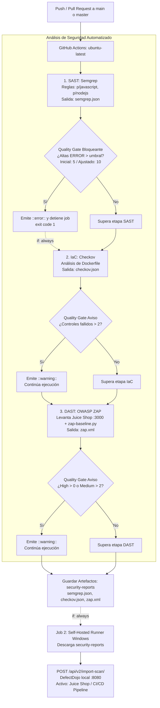
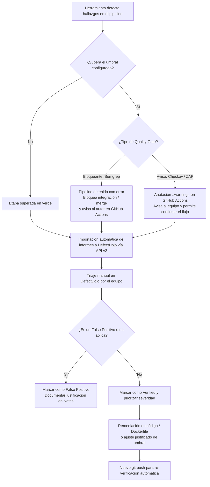

# Arquitectura del Pipeline DevSecOps y Gestión de Vulnerabilidades (PAI 4)

## 1. Diagrama del Pipeline CI/CD y Quality Gates

```mermaid
flowchart TD
    A[Push / Pull Request a main o master] --> B[GitHub Actions: ubuntu-latest]

    subgraph Escaneos [Análisis de Seguridad Automatizado]
        B --> C[1. SAST: Semgrep<br/>Reglas: p/javascript, p/nodejs<br/>Salida: semgrep.json]
        C --> D{Quality Gate Bloqueante<br/>¿Altas ERROR > umbral?<br/>Inicial: 5 / Ajustado: 10}
        D -- Sí --> E[Emite ::error:: y detiene job<br/>exit code 1]
        D -- No --> F[Supera etapa SAST]

        E -. if: always .-> G
        F --> G[2. IaC: Checkov<br/>Análisis de Dockerfile<br/>Salida: checkov.json]
        G --> H{Quality Gate Aviso<br/>¿Controles fallidos > 2?}
        H -- Sí --> I[Emite ::warning::<br/>Continúa ejecución]
        H -- No --> J[Supera etapa IaC]

        I --> K
        J --> K[3. DAST: OWASP ZAP<br/>Levanta Juice Shop :3000 + zap-baseline.py<br/>Salida: zap.xml]
        K --> L{Quality Gate Aviso<br/>¿High > 0 o Medium > 2?}
        L -- Sí --> M[Emite ::warning::<br/>Continúa ejecución]
        L -- No --> N[Supera etapa DAST]
    end

    M --> O
    N --> O[Guardar Artefactos: security-reports<br/>semgrep.json, checkov.json, zap.xml]

    O -. if: always .-> P[Job 2: Self-Hosted Runner Windows<br/>Descarga security-reports]
    P --> Q[POST /api/v2/import-scan/<br/>DefectDojo local :8080<br/>Activo: Juice Shop / CI/CD Pipeline]
```

## 2. Diagrama de Flujo de Actuación ante una Vulnerabilidad

```mermaid
flowchart TD
    A[Herramienta detecta hallazgos en el pipeline] --> B{¿Supera el umbral configurado?}

    B -- No --> C[Etapa superada en verde]
    B -- Sí --> D{¿Tipo de Quality Gate?}

    D -- Bloqueante: Semgrep --> E[Pipeline detenido con error<br/>Bloquea integración / merge<br/>y avisa al autor en GitHub Actions]
    D -- Aviso: Checkov / ZAP --> F[Anotación ::warning:: en GitHub Actions<br/>Avisa al equipo y permite continuar el flujo]

    C --> G
    E --> G[Importación automática de informes a DefectDojo vía API v2]
    F --> G

    G --> H[Triaje manual en DefectDojo por el equipo]
    H --> I{¿Es un Falso Positivo o no aplica?}

    I -- Sí --> J[Marcar como False Positive<br/>Documentar justificación en Notes]
    I -- No --> K[Marcar como Verified y priorizar severidad]

    K --> L[Remediación en código / Dockerfile<br/>o ajuste justificado de umbral]
    L --> M[Nuevo git push para re-verificación automática]
```
